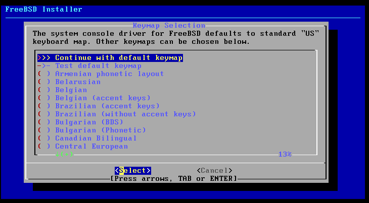
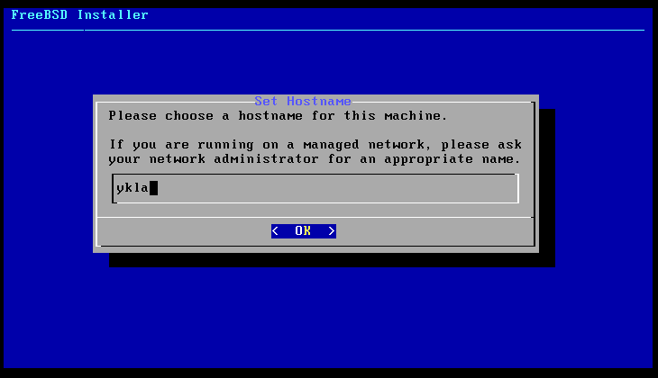
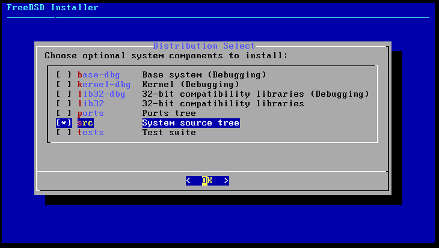
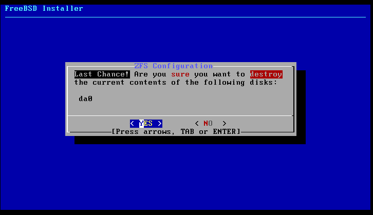
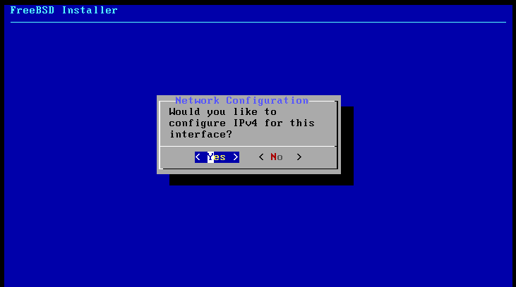
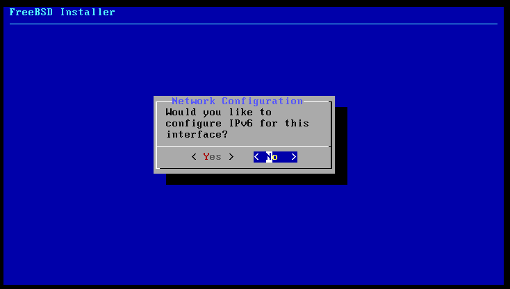
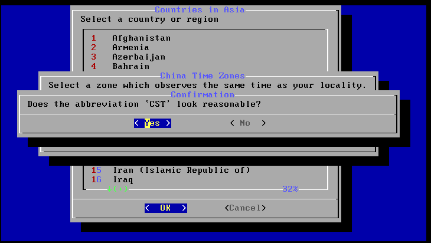
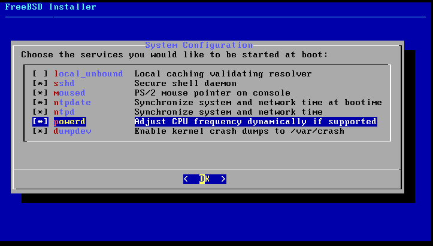
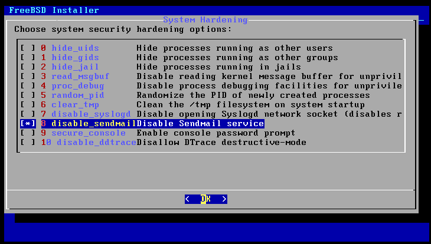
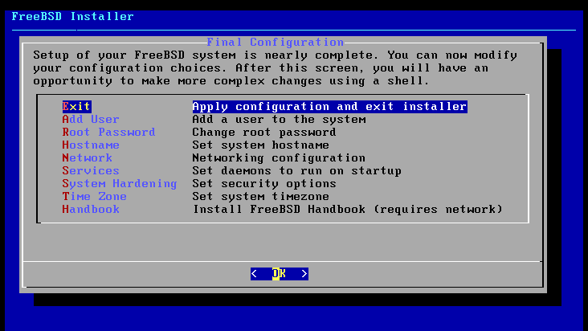

# 第〇节 图解安装

推荐等待十秒即可进入，也可以直接回车进入。

|      选项      |      解释     |
| :----------: | :---------: |
| ACPI Support |   ACPI 支持   |
|   Safe Mode  |     安全模式    |
|  Single User |    单用户模式    |
|    Verbose   | 啰嗦模式，显示更多输出 |

选择 `install`,按下 回车键 进行安装。

这里是设置键盘，直接回车即可。

此处是设置主机名。

推荐：只选 `src` 以及 `lib32` 。即使选了 `ports` 也不会安装的，还是空的。

|     选项     |                      解释                     |
| :--------: | :-----------------------------------------: |
|  base-dbg  |           基础工具，如 cat、ls 等，并激活调试符号           |
| kernel-dbg |                内核和模块的调试符号被激活                |
|  lib32-dbg | 用于在激活调试符号的 64 位版本的 FreeBSD 上运行 32 位应用程序的兼容库 |
|    lib32   |     用于在 64 位版本的 FreeBSD 上运行 32 位应用程序的兼容库    |
|    ports   |                    ports                    |
|     src    |                    系统源代码                    |
|    tests   |                     测试工具                    |

推荐：文件分区详解在第 6 章。这里推荐选择 auto ZFS/UFS

建议不选`local_unbound`，会影响 DNS，见 [https://bugs.freebsd.org/bugzilla/show\_bug.cgi?id=262290](https://bugs.freebsd.org/bugzilla/show\_bug.cgi?id=262290) 。

虚拟机不需要选`powerd`。

|       选项       |                        解释                       |
| :------------: | :---------------------------------------------: |
| local_unbound | 启用 DNS 本地非绑定。有必要记住，这是基础系统的非绑定，只用于作为本地缓存转发解析器使用。 |
|      sshd      |                    开启 ssh 服务                    |
|     moused     |                    在 tty 界面显示鼠标                   |
|     ntpdate    |                 启用启动时的自动时钟同步功能。                 |
|      ntpd      |            用于自动时钟同步的网络时间协议（NTP）守护程序。            |
|     powerd     |                       电源管理                      |
|     dumpdev    |                  启用崩溃转储，用于调试系统                  |

推荐选择：这里是安全增强选择，应该选择 `disable_sendmail`，如果不禁止这个服务会使你在每次开机的时候卡上几分钟，而且这个服务本身没什么用，发邮件用的。

